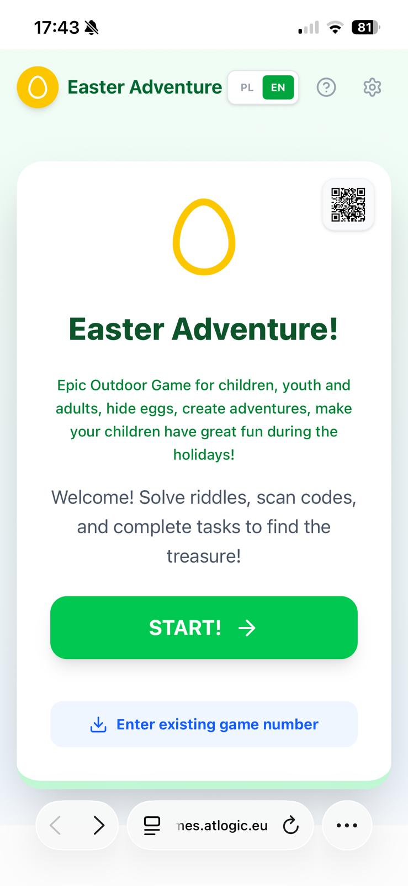
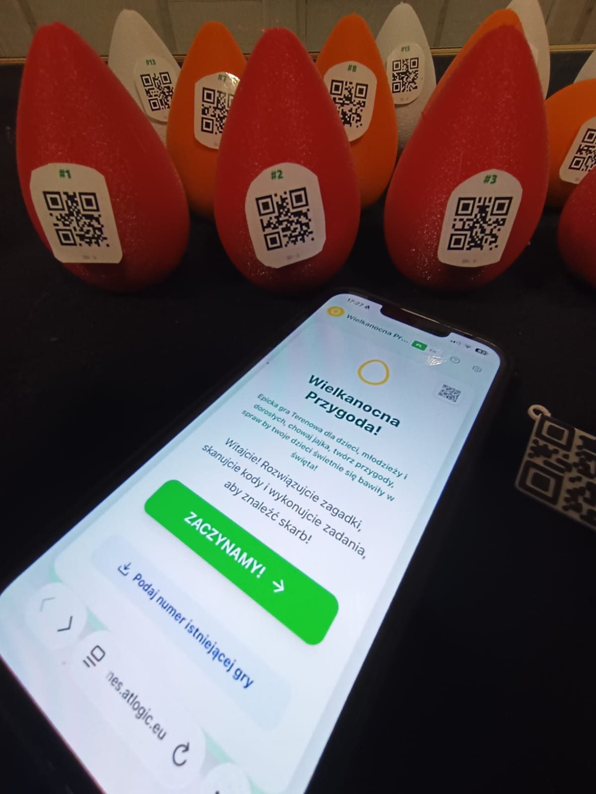
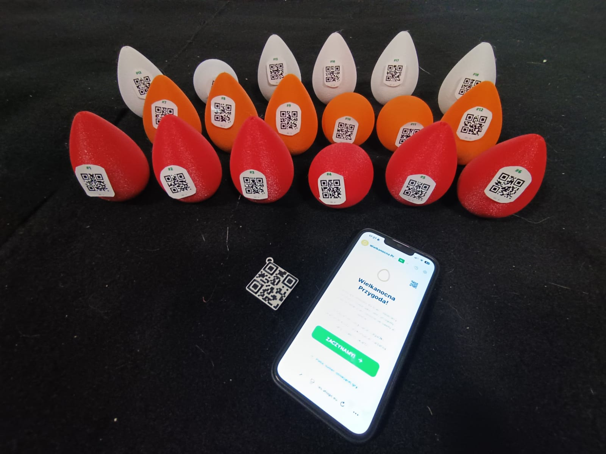

# Easter Adventure

Create a magical Easter egg hunt in minutes.

`Easter Adventure` is a mobile-friendly QR scavenger hunt app for families. A parent creates a route, prints QR codes, hides eggs, and kids scan, solve riddles, complete tasks, and race to the treasure.

Live demo: [https://eastergame.atlogic.eu/](https://eastergame.atlogic.eu/)

## Screenshots






## Why People Like It

- It turns a simple egg hunt into a real adventure.
- It is easy to explain in a few seconds.
- It works in the garden, at home, in school, or during family events.
- It blends physical play with a lightweight digital experience.

## What You Can Do

- Build custom game routes in the parent panel.
- Add riddles, hints, images, photo tasks, audio tasks, and evaluations.
- Generate printable QR checkpoints.
- Share a game with a simple link or QR code.
- Play on mobile with built-in QR scanning.
- Use the app in Polish or English.

## How It Works

1. Create a route.
2. Print the QR sheet.
3. Hide the eggs or QR markers.
4. Open the game on a phone.
5. Scan, solve, and play your way to the treasure.

## Perfect For

- Parents who want a memorable Easter activity
- Teachers and event organizers
- Makers who enjoy playful real-world tech
- Anyone looking for a reusable QR scavenger hunt template

## Demo

Try the public demo here:

[https://eastergame.atlogic.eu/](https://eastergame.atlogic.eu/)

## Tech Stack

- React
- TypeScript
- Vite
- Firebase Auth
- Firestore
- QRCode generation
- Mobile QR scanning
- Cloudflare Pages

## Local Development

```bash
npm install
npm run dev
```

## Firebase Setup

If you want to run your own copy, create your own Firebase project and configure:

- Firestore Database
- Firebase Authentication
- Firestore security rules from `firestore.rules`

This repository uses a public client-side Firebase config, which is normal for Firebase web apps. Access control is enforced by Firebase security rules.

## Security Notes

- Parent-owned game management is protected by Firebase Authentication.
- Firestore access is restricted by server-side rules.
- Local env files are ignored in git to avoid accidental commits.

This project is meant to be a public demo and portfolio app, not a high-risk enterprise platform.

## Why This Repo Exists

I wanted to build something playful, useful, and real: not another dashboard, but a tiny product families can actually use during Easter.

If this project made you smile, helped with your holiday plans, or inspired your own interactive game, consider starring the repo.

## License

MIT
